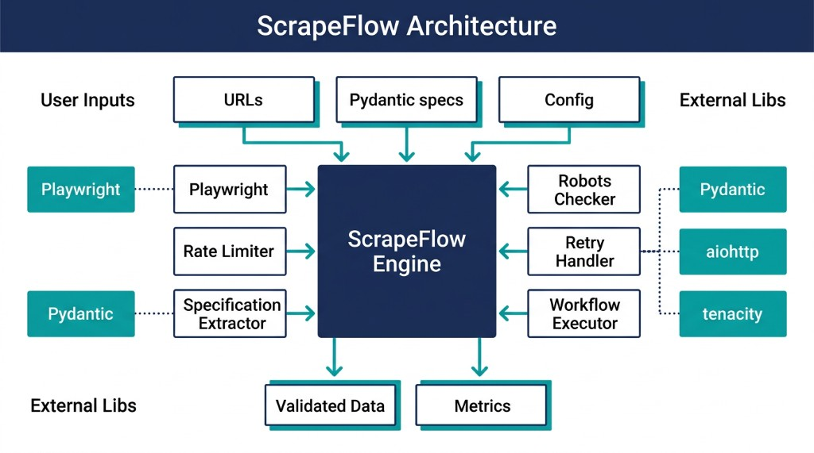

# ScrapeFlow

**An opinionated scraping workflow engine built on Playwright**

[](https://github.com/irfanalidv/scrapeflow-py/blob/main/LICENSE) [](https://pypi.org/project/scrapeflow-py/) [](https://pepy.tech/projects/scrapeflow-py) [](https://www.python.org/) [](https://playwright.dev/) [](https://github.com/irfanalidv/scrapeflow-py)

---

ScrapeFlow is a production-ready Python library that transforms Playwright into a powerful, enterprise-grade web scraping framework. It handles the common challenges of web scraping: retries, rate limiting, anti-detection, error recovery, and workflow orchestration.

## 🚀 Features

- **📋 Specification-Driven Extraction**: Declarative Pydantic models define fields, types, and validation—decouple field definitions from page structure
- **🤖 robots.txt Compliance**: Built-in robots.txt parsing and enforcement; ethical crawling by design
- **⚖️ Ethical Crawling (GDPR/CCPA)**: Configurable data retention, anonymization, and consent options in the specification layer
- **📦 Component Registry**: Shared, versioned selectors, pagination handlers, and login flows—platform thinking over one-off scrapers
- **🔔 Monitoring & Alerting**: Alert callbacks on failure thresholds; rollback hooks for failed extraction runs
- **🔌 MCP Extensibility**: Pluggable backends for Scrapy MCP Server, Playwright MCP, or LLM-based semantic extraction
- **🔄 Intelligent Retry Logic**: Automatic retries with exponential backoff and jitter
- **⚡ Rate Limiting**: Token bucket algorithm to respect server limits
- **🕵️ Anti-Detection**: Stealth mode, user agent rotation, and proxy support
- **📊 Workflow Engine**: Define complex scraping workflows with steps and conditions
- **📈 Monitoring & Metrics**: Built-in performance monitoring and logging
- **🛠️ Data Extraction**: Powerful utilities for extracting structured data
- **🔧 Error Handling**: Comprehensive error classification and recovery
- **📝 Type Hints**: Full type support for better IDE experience

<p align="center">
  
</p>

## 📦 Installation

```bash
pip install scrapeflow-py
```

Or install from source:

```bash
git clone https://github.com/irfanalidv/scrapeflow-py.git
cd scrapeflow-py
pip install -e .
```

**Note**: After installation, install Playwright browsers:

```bash
playwright install
```

## 🎯 Real-World Use Cases

ScrapeFlow is used in production for:

- **💰 E-commerce Price Monitoring** - Track competitor prices, monitor deals, and optimize pricing strategies
- **📰 News & Content Aggregation** - Collect articles from multiple sources for content platforms
- **💼 Job Listings Scraping** - Aggregate job postings from various job boards
- **🏠 Real Estate Data Collection** - Monitor property listings, prices, and market trends
- **⭐ Product Review Analysis** - Extract and analyze customer reviews for market research
- **📊 Market Research** - Gather competitor data, customer sentiment, and industry trends
- **🔍 Lead Generation** - Extract contact information from business directories
- **📈 Financial Data Collection** - Monitor stock prices, cryptocurrency data, and market indicators

## 🚀 Quick Start

### Use Case 1: Scraping Quotes with Retry & Rate Limiting

**Real-world scenario:** Collecting inspirational quotes from [quotes.toscrape.com](https://quotes.toscrape.com/) - a real website designed for scraping practice.

```python
import asyncio
from scrapeflow import ScrapeFlow
from scrapeflow.config import ScrapeFlowConfig, RateLimitConfig, RetryConfig
from scrapeflow.extractors import Extractor

async def main():
    # Configure for production scraping
    config = ScrapeFlowConfig(
        rate_limit=RateLimitConfig(requests_per_second=2.0),  # Respect server limits
        retry=RetryConfig(max_retries=3, initial_delay=1.0),  # Auto-retry on failures
    )

    async with ScrapeFlow(config) as scraper:
        await scraper.navigate("https://quotes.toscrape.com/")

        # Extract all quotes from the page
        quotes = []
        quote_elements = scraper.page.locator(".quote")
        count = await quote_elements.count()

        for i in range(count):
            quote_elem = quote_elements.nth(i)
            text = await quote_elem.locator(".text").text_content()
            author = await quote_elem.locator(".author").text_content()
            tags = await Extractor.extract_texts(quote_elem, ".tag")

            quotes.append({
                "quote": text.strip() if text else "",
                "author": author.strip() if author else "",
                "tags": tags
            })

        print(f"Scraped {len(quotes)} quotes")
        for quote in quotes[:3]:  # Show first 3
            print(f"\n{quote['quote']}\n— {quote['author']}")

asyncio.run(main())
```

**Real Output:**

```
Scraped 10 quotes from quotes.toscrape.com

1. Quote: "The world as we have created it is a process of our thinking. It cannot be changed without changing our thinking."
   Author: Albert Einstein
   Tags: ['change', 'deep-thoughts', 'thinking', 'world']

2. Quote: "It is our choices, Harry, that show what we truly are, far more than our abilities."
   Author: J.K. Rowling
   Tags: ['abilities', 'choices']

3. Quote: "There are only two ways to live your life. One is as though nothing is a miracle. The other is as though everything is a miracle."
   Author: Albert Einstein
   Tags: ['inspirational', 'life', 'live', 'miracle', 'miracles']
```

### Use Case 2: E-commerce Book Scraping Workflow

**Real-world scenario:** Scraping book data from [books.toscrape.com](https://books.toscrape.com/) - a real e-commerce site designed for scraping practice.

```python
import asyncio
from scrapeflow import ScrapeFlow, Workflow
from scrapeflow.config import ScrapeFlowConfig
from scrapeflow.extractors import StructuredExtractor

async def scrape_books(page, context):
    """Extract book listings from the page."""
    schema = {
        "books": {
            "items": "article.product_pod",
            "schema": {
                "title": "h3 a",
                "price": ".price_color",
                "availability": ".instock.availability"
            }
        }
    }
    extractor = StructuredExtractor(schema)
    return await extractor.extract(page)

async def check_affordable_books(data, context):
    """Callback to find affordable books."""
    for book in data.get("books", []):
        price_str = book.get("price", "").replace("£", "").strip()
        try:
            price = float(price_str)
            if price < 20.0:  # Books under £20
                print(f"💰 Affordable: {book['title'][:50]}... - £{price}")
        except ValueError:
            pass

async def main():
    config = ScrapeFlowConfig()
    async with ScrapeFlow(config) as scraper:
        workflow = Workflow(name="book_scraper")

        # Step 1: Navigate to books page
        async def navigate_to_books(page, context):
            scraper = context["scraper"]
            await scraper.navigate("https://books.toscrape.com/")
            await scraper.wait_for_selector("article.product_pod", timeout=10000)

        # Step 2: Extract book data
        workflow.add_step("navigate", navigate_to_books, required=True)
        workflow.add_step("extract", scrape_books, on_success=check_affordable_books)

        # Execute workflow
        result = await scraper.run_workflow(workflow)
        print(f"✅ Scraped {len(result.final_data.get('books', []))} books")

asyncio.run(main())
```

**Real Output:**

```
Workflow 'book_scraper' completed. Success: True, Steps: 2/2
✅ Scraped 20 books
```

### Use Case 3: Quote Aggregation with Anti-Detection

**Real-world scenario:** Collecting quotes from [quotes.toscrape.com](https://quotes.toscrape.com/) while avoiding detection using stealth mode and user agent rotation.

```python
import asyncio
from scrapeflow import ScrapeFlow
from scrapeflow.config import (
    ScrapeFlowConfig,
    AntiDetectionConfig,
    RateLimitConfig
)
from scrapeflow.extractors import Extractor

async def scrape_quotes_with_stealth():
    """Scrape quotes with anti-detection enabled."""
    config = ScrapeFlowConfig(
        anti_detection=AntiDetectionConfig(
            rotate_user_agents=True,  # Rotate user agents
            stealth_mode=True,        # Remove automation indicators
            viewport_width=1920,
            viewport_height=1080
        ),
        rate_limit=RateLimitConfig(requests_per_second=1.0)  # Be respectful
    )

    async with ScrapeFlow(config) as scraper:
        # Navigate to quotes site
        await scraper.navigate("https://quotes.toscrape.com/")

        # Verify stealth mode is working
        user_agent = await scraper.page.evaluate("() => navigator.userAgent")
        page_title = await scraper.page.title()

        # Extract quote data
        quotes = []
        quote_elements = scraper.page.locator(".quote")
        count = await quote_elements.count()

        for i in range(count):
            quote_elem = quote_elements.nth(i)
            text = await quote_elem.locator(".text").text_content()
            author = await quote_elem.locator(".author").text_content()

            quotes.append({
                "quote": text.strip() if text else "",
                "author": author.strip() if author else "",
                "url": await scraper.page.url
            })

        return quotes, user_agent, page_title

# Run the scraper
quotes, ua, title = asyncio.run(scrape_quotes_with_stealth())
print(f"📰 Collected {len(quotes)} quotes from {title}")
print(f"🕵️ User Agent: {ua[:60]}...")
print(f"\nFirst quote: {quotes[0]['quote'][:80]}...")
```

**Real Output:**

```
📰 Collected 10 quotes from Quotes to Scrape
🕵️ User Agent: Mozilla/5.0 (Windows NT 10.0; Win64; x64; rv:120.0) Gecko/20100101...

First quote: "The world as we have created it is a process of our thinking. It cannot be changed without changing our thinking."
```

### Use Case 4: Multi-Page Scraping with Error Handling & Metrics

**Real-world scenario:** Scraping multiple pages from [quotes.toscrape.com](https://quotes.toscrape.com/) with comprehensive error handling and performance monitoring.

```python
import asyncio
from scrapeflow import ScrapeFlow
from scrapeflow.config import ScrapeFlowConfig, RetryConfig
from scrapeflow.exceptions import (
    ScrapeFlowBlockedError,
    ScrapeFlowTimeoutError,
    ScrapeFlowRetryError
)
from scrapeflow.extractors import Extractor

async def scrape_multiple_pages():
    config = ScrapeFlowConfig(
        retry=RetryConfig(max_retries=5, initial_delay=2.0),
        log_level="INFO"
    )

    try:
        async with ScrapeFlow(config) as scraper:
            # Scrape multiple pages
            all_quotes = []
            pages = [
                "https://quotes.toscrape.com/",
                "https://quotes.toscrape.com/page/2/",
            ]

            for url in pages:
                await scraper.navigate(url)

                # Extract quotes
                quote_elements = scraper.page.locator(".quote")
                count = await quote_elements.count()

                for i in range(count):
                    quote_elem = quote_elements.nth(i)
                    text = await quote_elem.locator(".text").text_content()
                    author = await quote_elem.locator(".author").text_content()

                    all_quotes.append({
                        "quote": text.strip() if text else "",
                        "author": author.strip() if author else "",
                    })

            # Get performance metrics
            metrics = scraper.get_metrics()
            print(f"📊 Success rate: {metrics.get_success_rate():.2f}%")
            print(f"📊 Total requests: {metrics.total_requests}")
            print(f"📊 Average response time: {metrics.average_response_time:.2f}s")

            return all_quotes

    except ScrapeFlowBlockedError as e:
        print(f"🚫 Blocked! Retry after {e.retry_after} seconds")
        return []
    except ScrapeFlowTimeoutError:
        print("⏱️ Request timed out")
        return []
    except ScrapeFlowRetryError as e:
        print(f"❌ Failed after {e.retry_count} retries")
        return []

quotes = asyncio.run(scrape_multiple_pages())
print(f"💼 Found {len(quotes)} quotes across pages")
```

**Real Output:**

```
📊 Success rate: 100.00%
📊 Total requests: 2
📊 Average response time: 1.10s
💼 Found 20 quotes across pages
```

## 📚 Documentation

### Configuration

**Use Case:** Setting up a production-ready scraper for monitoring competitor prices across multiple sites.

```python
from scrapeflow.config import (
    ScrapeFlowConfig,
    AntiDetectionConfig,
    RateLimitConfig,
    RetryConfig,
    BrowserConfig,
    BrowserType,
)

# Production configuration for price monitoring
config = ScrapeFlowConfig(
    browser=BrowserConfig(
        browser_type=BrowserType.CHROMIUM,
        headless=True,  # Run in background
        timeout=30000,   # 30 second timeout
    ),
    retry=RetryConfig(
        max_retries=5,           # Retry up to 5 times
        initial_delay=1.0,       # Start with 1 second delay
        max_delay=60.0,          # Cap at 60 seconds
        exponential_base=2.0,     # Double delay each retry
        jitter=True,              # Add randomness
    ),
    rate_limit=RateLimitConfig(
        requests_per_second=2.0,  # Max 2 requests/second
        burst_size=5,              # Allow bursts of 5
    ),
    anti_detection=AntiDetectionConfig(
        rotate_user_agents=True,   # Rotate user agents
        stealth_mode=True,          # Remove automation traces
        viewport_width=1920,
        viewport_height=1080,
    ),
    log_level="INFO",  # Log important events
)
```

### Specification-Driven Extraction (Pydantic)

**Use Case:** Declarative extraction with validation—fields, types, and rules in specs, not fragile XPaths.

```python
from pydantic import BaseModel
from scrapeflow import ScrapeFlow, SpecificationExtractor
from scrapeflow.specifications import FieldSpec, ItemSpec, ProductPriceSpec

# Model for list of products
class BookListing(BaseModel):
    books: list[ProductPriceSpec]

# Schema maps fields to selectors
schema = {
    "books": ItemSpec(
        items_selector="article.product_pod",
        fields={
            "title": FieldSpec(selector="h3 a"),
            "price": FieldSpec(selector=".price_color"),
            "availability": FieldSpec(selector=".instock.availability", default=""),
            "url": FieldSpec(selector="h3 a", type="attribute", attribute="href"),
        },
    )
}

async with ScrapeFlow() as scraper:
    await scraper.navigate("https://books.toscrape.com/")
    extractor = SpecificationExtractor(BookListing, schema=schema)
    # Extract and validate in one step
    data = await extractor.extract(scraper.page)
    for book in data.books:
        print(f"{book.title}: {book.price}")
```

### Ethical Crawling & robots.txt

**Use Case:** GDPR/CCPA compliance and robots.txt respect built into the specification layer.

```python
from scrapeflow import ScrapeFlow
from scrapeflow.config import ScrapeFlowConfig, EthicalCrawlingConfig

config = ScrapeFlowConfig(
    ethical_crawling=EthicalCrawlingConfig(
        respect_robots_txt=True,      # Check robots.txt before each request
        user_agent_for_robots="ScrapeFlow",
        anonymize_ip=True,            # GDPR: minimize personal data
        data_retention_days=30,       # Document retention policy
    )
)

async with ScrapeFlow(config) as scraper:
    # navigate() automatically checks robots.txt
    await scraper.navigate("https://example.com/page")
```

### Anti-Detection

**Use Case:** Scraping protected e-commerce sites that block automated access.

```python
from scrapeflow.config import ScrapeFlowConfig, AntiDetectionConfig

# Configure anti-detection for protected sites
config = ScrapeFlowConfig(
    anti_detection=AntiDetectionConfig(
        # Rotate user agents to appear as different browsers
        rotate_user_agents=True,
        user_agents=[
            "Mozilla/5.0 (Windows NT 10.0; Win64; x64) AppleWebKit/537.36 Chrome/120.0.0.0",
            "Mozilla/5.0 (Macintosh; Intel Mac OS X 10_15_7) AppleWebKit/537.36 Safari/537.36",
            "Mozilla/5.0 (X11; Linux x86_64) AppleWebKit/537.36 Firefox/120.0",
        ],
        # Enable stealth mode to remove automation indicators
        stealth_mode=True,  # Removes webdriver property, mocks plugins, etc.
        # Use realistic viewport sizes
        viewport_width=1920,
        viewport_height=1080,
        # Optional: Rotate proxies for additional protection
        rotate_proxies=True,
        proxies=[
            {"server": "http://proxy1.example.com:8080"},
            {"server": "http://proxy2.example.com:8080"},
        ],
    )
)

async with ScrapeFlow(config) as scraper:
    # This will use stealth techniques automatically
    await scraper.navigate("https://protected-site.com")
    # Your scraping code here...
```

### Rate Limiting

**Use Case:** Respecting API rate limits when scraping multiple pages to avoid getting blocked.

```python
from scrapeflow import ScrapeFlow
from scrapeflow.config import ScrapeFlowConfig, RateLimitConfig

config = ScrapeFlowConfig(
    rate_limit=RateLimitConfig(
        requests_per_second=1.0,    # Max 1 request per second
        requests_per_minute=60.0,   # Or 60 requests per minute
        burst_size=5,                # Allow bursts of 5 requests
    )
)

async with ScrapeFlow(config) as scraper:
    # Scrape multiple pages - rate limiter ensures we don't exceed limits
    urls = [
        "https://quotes.toscrape.com/page/1/",
        "https://quotes.toscrape.com/page/2/",
        "https://quotes.toscrape.com/page/3/",
    ]

    for url in urls:
        await scraper.navigate(url)  # Automatically rate-limited
        # Extract data...
        print(f"Scraped: {url}")
        # Rate limiter ensures proper delays between requests
```

### Retry Logic

**Use Case:** Handling network failures and temporary server errors when scraping unreliable sources.

```python
from scrapeflow import ScrapeFlow
from scrapeflow.config import ScrapeFlowConfig, RetryConfig

config = ScrapeFlowConfig(
    retry=RetryConfig(
        max_retries=5,              # Retry up to 5 times
        initial_delay=1.0,          # Start with 1 second delay
        max_delay=60.0,             # Cap at 60 seconds
        exponential_base=2.0,       # Double delay each retry (1s, 2s, 4s, 8s...)
        jitter=True,                 # Add randomness to avoid thundering herd
    )
)

async with ScrapeFlow(config) as scraper:
    # If this fails, it will automatically retry with exponential backoff
    await scraper.navigate("https://unreliable-site.com/products")
    # Retry logic handles:
    # - Network timeouts
    # - 500/502/503 server errors
    # - Connection errors
    # - Temporary blocks
```

### Data Extraction

**Use Case:** Extracting structured data from [quotes.toscrape.com](https://quotes.toscrape.com/) and [books.toscrape.com](https://books.toscrape.com/).

```python
import asyncio
from scrapeflow import ScrapeFlow
from scrapeflow.extractors import Extractor, StructuredExtractor

async def main():
    async with ScrapeFlow() as scraper:
        await scraper.navigate("https://quotes.toscrape.com/")

        # Method 1: Simple extraction
        page_title = await Extractor.extract_text(scraper.page, "h1")
        all_links = await Extractor.extract_links(scraper.page, "a")

        # Method 2: Structured extraction with schema (Best for complex pages)
        schema = {
            "page_title": "h1",
            "quotes": {
                "items": ".quote",  # Find all quote elements
                "schema": {
                    "text": ".text",           # Extract quote text
                    "author": ".author",       # Extract author
                    "tags": ".tag",            # Extract all tags
                },
            },
        }
        extractor = StructuredExtractor(schema)
        structured_data = await extractor.extract(scraper.page)

        print(f"Page: {structured_data['page_title']}")
        print(f"Quotes found: {len(structured_data['quotes'])}")
        if structured_data['quotes']:
            first = structured_data['quotes'][0]
            print(f"First quote: {first['text'][:60]}...")
            print(f"Author: {first['author']}")
            print(f"Tags: {first['tags']}")

asyncio.run(main())
```

**Real Output:**

```
Page: Quotes to Scrape
Quotes found: 10
First quote: "The world as we have created it is a process of our thinkin...
Author: Albert Einstein
Tags: ['change', 'deep-thoughts', 'thinking', 'world']
```

### Workflows

**Use Case:** Building a multi-step scraper that navigates, extracts, and processes data with error handling.

```python
import asyncio
from scrapeflow import ScrapeFlow, Workflow
from scrapeflow.extractors import Extractor

async def login_step(page, context):
    """Step 1: Login to the site"""
    # Scraper is automatically available in context
    scraper = context["scraper"]
    await scraper.navigate("https://example.com/login")
    await scraper.fill("#username", context["username"])
    await scraper.fill("#password", context["password"])
    await scraper.click("button[type='submit']")
    await scraper.wait_for_selector(".dashboard", timeout=10000)

async def extract_products(page, context):
    """Step 2: Extract product data"""
    products = []
    product_elements = page.locator(".product")
    count = await product_elements.count()

    for i in range(count):
        product = product_elements.nth(i)
        products.append({
            "name": await Extractor.extract_text(product, ".name"),
            "price": await Extractor.extract_text(product, ".price"),
        })
    return products

async def save_to_database(data, context):
    """Callback: Save extracted data"""
    print(f"💾 Saving {len(data)} products to database...")
    # Your database save logic here

async def handle_error(error, context):
    """Callback: Handle errors"""
    print(f"❌ Error in workflow: {error}")
    # Your error handling logic here

async def main():
    async with ScrapeFlow() as scraper:
        workflow = Workflow(name="product_scraper")

        # Step 1: Login (required - stops workflow if fails)
        workflow.add_step(
            name="login",
            func=login_step,
            required=True,
            retryable=True,
        )

        # Step 2: Extract products (only if login succeeded)
        workflow.add_step(
            name="extract",
            func=extract_products,
            retryable=True,
            on_success=save_to_database,
            on_error=handle_error,
            condition=lambda ctx: ctx.get("logged_in", False),  # Conditional
        )

        # Set context
        workflow.set_context("username", "user@example.com")
        workflow.set_context("password", "secret123")

        # Execute workflow
        result = await scraper.run_workflow(workflow)
        print(f"✅ Workflow completed: {result.success}")

asyncio.run(main())
```

### Monitoring & Metrics

**Use Case:** Monitoring scraping performance when scraping multiple pages from [quotes.toscrape.com](https://quotes.toscrape.com/).

```python
import asyncio
from scrapeflow import ScrapeFlow

async def main():
    async with ScrapeFlow() as scraper:
        # Perform multiple scraping operations
        urls = [
            "https://quotes.toscrape.com/",
            "https://quotes.toscrape.com/page/2/",
        ]

        for url in urls:
            await scraper.navigate(url)
            # Extract data...

        # Get comprehensive metrics
        metrics = scraper.get_metrics()

        print(f"📊 Performance Metrics:")
        print(f"   Success Rate: {metrics.get_success_rate():.2f}%")
        print(f"   Total Requests: {metrics.total_requests}")
        print(f"   Successful: {metrics.successful_requests}")
        print(f"   Failed: {metrics.failed_requests}")
        print(f"   Retries: {metrics.retry_count}")
        print(f"   Avg Response Time: {metrics.average_response_time:.2f}s")
        print(f"   Total Duration: {metrics.total_duration:.2f}s")

        # Reset metrics for next batch
        scraper.reset_metrics()

asyncio.run(main())
```

**Real Output:**

```
📊 Performance Metrics:
   Success Rate: 100.00%
   Total Requests: 2
   Successful: 2
   Failed: 0
   Retries: 0
   Avg Response Time: 1.10s
   Total Duration: 2.20s
```

### Error Handling

**Use Case:** Gracefully handling different types of errors when scraping [quotes.toscrape.com](https://quotes.toscrape.com/).

```python
import asyncio
from scrapeflow import ScrapeFlow
from scrapeflow.exceptions import (
    ScrapeFlowError,
    ScrapeFlowRetryError,
    ScrapeFlowTimeoutError,
    ScrapeFlowBlockedError,
)

async def scrape_with_error_handling():
    async with ScrapeFlow() as scraper:
        try:
            await scraper.navigate("https://quotes.toscrape.com/")
            title = await scraper.page.title()
            print(f"✅ Successfully scraped: {title}")

        except ScrapeFlowBlockedError as e:
            # Site blocked us - wait and retry later
            print(f"🚫 Blocked! Retry after {e.retry_after} seconds")

        except ScrapeFlowTimeoutError:
            # Request took too long
            print("⏱️ Request timed out - site may be slow")

        except ScrapeFlowRetryError as e:
            # All retries exhausted
            print(f"❌ Failed after {e.retry_count} retries")

        except ScrapeFlowError as e:
            # Generic ScrapeFlow error
            print(f"⚠️ ScrapeFlow error: {e}")

        except Exception as e:
            # Other unexpected errors
            print(f"💥 Unexpected error: {e}")

asyncio.run(scrape_with_error_handling())
```

**Real Output:**

```
✅ Successfully scraped: Quotes to Scrape
```

## 🎨 Complete Examples

Check out the `examples/` directory for more examples:

- `basic_usage.py` - Simple scraping example
- `workflow_example.py` - Workflow orchestration
- `advanced_example.py` - All features combined

### Example: Complete Book Scraper with All Features

**Real-world scenario:** Complete example scraping books from [books.toscrape.com](https://books.toscrape.com/) using all ScrapeFlow features.

```python
import asyncio
from scrapeflow import ScrapeFlow, Workflow
from scrapeflow.config import (
    ScrapeFlowConfig,
    AntiDetectionConfig,
    RateLimitConfig,
    RetryConfig
)
from scrapeflow.extractors import StructuredExtractor

async def scrape_books_complete():
    """Complete book scraping solution with all ScrapeFlow features."""

    config = ScrapeFlowConfig(
        anti_detection=AntiDetectionConfig(
            rotate_user_agents=True,
            stealth_mode=True,
        ),
        rate_limit=RateLimitConfig(requests_per_second=1.0),
        retry=RetryConfig(max_retries=3),
    )

    async with ScrapeFlow(config) as scraper:
        workflow = Workflow(name="book_monitor")

        async def extract_books(page, context):
            schema = {
                "books": {
                    "items": "article.product_pod",
                    "schema": {
                        "title": "h3 a",
                        "price": ".price_color",
                    }
                }
            }
            extractor = StructuredExtractor(schema)
            return await extractor.extract(page)

        async def navigate_to_books(page, context):
            scraper = context["scraper"]
            await scraper.navigate("https://books.toscrape.com/")
            await scraper.wait_for_selector("article.product_pod", timeout=10000)

        workflow.add_step("navigate", navigate_to_books, required=True)
        workflow.add_step("extract", extract_books)

        result = await scraper.run_workflow(workflow)

        # Get metrics
        metrics = scraper.get_metrics()
        books = result.final_data.get("books", [])
        print(f"✅ Scraped {len(books)} books")
        print(f"📊 Success rate: {metrics.get_success_rate():.2f}%")
        print(f"📊 Average response time: {metrics.average_response_time:.2f}s")

        if books:
            print(f"\n📚 Sample books:")
            for book in books[:3]:
                print(f"   - {book.get('title', '')[:40]}... - {book.get('price', '')}")

        return result.final_data

asyncio.run(scrape_books_complete())
```

**Real Output:**

```
Workflow 'book_monitor' completed. Success: True, Steps: 2/2
✅ Scraped 20 books
📊 Success rate: 100.00%
📊 Average response time: 1.15s

📚 Sample books:
   - A Light in the Attic... - £51.77
   - Tipping the Velvet... - £53.74
   - Soumission... - £50.10
```

## 🏗️ Architecture

ScrapeFlow is built with a modular architecture:

```
scrapeflow/
├── engine.py          # Main ScrapeFlow engine
├── ports.py           # Protocols for dependency inversion
├── browser_runtime.py # Playwright runtime adapter
├── workflow.py        # Workflow definition entities
├── workflow_executor.py # Workflow execution service
├── config.py          # Configuration classes (incl. EthicalCrawlingConfig)
├── specifications.py  # Pydantic specification-driven extraction
├── schema_library.py  # Reusable schema definitions
├── robots.py          # robots.txt parsing and enforcement
├── registry.py        # Shared selector/component registry
├── mcp_backend.py     # MCP integration extensibility
├── anti_detection.py  # Anti-detection utilities
├── rate_limiter.py    # Rate limiting implementation
├── retry.py           # Retry logic and error classification
├── monitoring.py      # Metrics, logging, alerting
├── extractors.py      # Data extraction utilities
└── exceptions.py      # Custom exceptions
```

For deeper design details, see [`ARCHITECTURE.md`](ARCHITECTURE.md).

## 🤝 Contributing

Contributions are welcome! Please feel free to submit a Pull Request.

1. Fork the repository
2. Create your feature branch (`git checkout -b feature/AmazingFeature`)
3. Commit your changes (`git commit -m 'Add some AmazingFeature'`)
4. Push to the branch (`git push origin feature/AmazingFeature`)
5. Open a Pull Request

## 📝 License

This project is licensed under the MIT License - see the [LICENSE](LICENSE) file for details.

## 🙏 Acknowledgments

- Built on top of [Playwright](https://playwright.dev/) - an amazing browser automation library
- Inspired by the need for production-ready scraping solutions

## 📧 Contact

Irfan Ali - [GitHub](https://github.com/irfanalidv)

Project Link: [https://github.com/irfanalidv/scrapeflow-py](https://github.com/irfanalidv/scrapeflow-py)

---

**Made with ❤️ for the scraping community**
